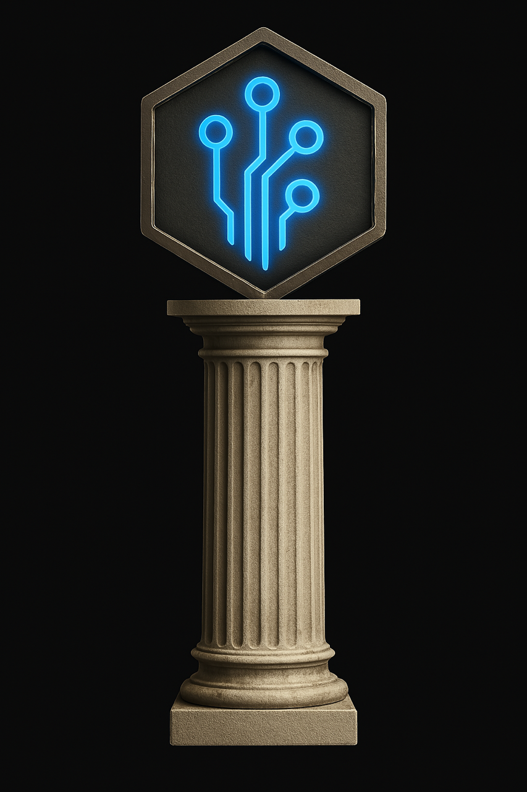

# Hephaestus User Guide

This guide provides practical instructions for users of the Hephaestus UI component, focusing on day-to-day usage rather than technical implementation details.

## Table of Contents

- [Introduction](#introduction)
- [Getting Started](#getting-started)
- [User Interface Overview](#user-interface-overview)
- [Component Navigation](#component-navigation)
- [Terminal Integration](#terminal-integration)
- [User Preferences](#user-preferences)
- [Working with Tekton Components](#working-with-tekton-components)
- [Keyboard Shortcuts](#keyboard-shortcuts)
- [Troubleshooting](#troubleshooting)
- [Best Practices](#best-practices)

## Introduction

Hephaestus is the unified user interface for the Tekton ecosystem, providing a seamless way to interact with all Tekton components through a modern web-based dashboard. It offers both terminal and graphical interfaces, allowing you to choose the most appropriate interaction mode for your tasks.

## Getting Started

### Accessing Hephaestus

Hephaestus is a web-based interface that can be accessed through your browser:

1. Make sure Hephaestus is running:
   ```bash
   ./scripts/tekton-launch --components hephaestus
   ```

2. Open your browser and navigate to:
   ```
   http://localhost:8080
   ```

3. You'll be presented with the Hephaestus dashboard, showing available Tekton components.

### First-Time Setup

When launching Hephaestus for the first time:

1. **Choose your theme preference**: Select between light and dark themes from the settings menu (gear icon in the top-right corner).

2. **Configure your default view**: Set your preferred starting component from the settings menu.

3. **Review available components**: The sidebar displays all available Tekton components. Click on each to explore their functionality.

## User Interface Overview

Hephaestus features a clean, intuitive interface:

### Main Layout



1. **Top Navigation Bar**:
   - Tekton logo: Click to return to the dashboard
   - Component title: Shows the current component
   - Settings menu: Access user preferences
   - Theme toggle: Switch between light and dark themes
   - Status indicator: Shows system health

2. **Sidebar**:
   - Component navigation
   - Collapsible for more screen space
   - Organized by functionality

3. **Main Content Area**:
   - Component-specific interface
   - Context-sensitive tools
   - Tabbed interface for multiple contexts

4. **Status Bar**:
   - System messages
   - Connection status
   - Quick actions

### Themes

Hephaestus supports both light and dark themes:

- **Light Theme**: Default theme with light background and dark text
- **Dark Theme**: Reduced eye strain in low-light environments

Toggle between themes using the theme icon in the top navigation bar or in settings.

## Component Navigation

The sidebar provides navigation to all available Tekton components:

### Component Categories

Components are organized into functional categories:

1. **Communication**:
   - Terma: Terminal interface
   - Rhetor: Prompt engineering

2. **Knowledge Management**:
   - Athena: Knowledge graph
   - Engram: Memory management
   - Codex: Code exploration

3. **Task Management**:
   - Ergon: Task and agent orchestration
   - Synthesis: Workflow execution

4. **Planning**:
   - Prometheus: Planning and project management
   - Telos: Requirements management

5. **Analysis**:
   - Sophia: Intelligence measurement

### Navigation Tips

- Click on a component to navigate to it
- Use keyboard shortcuts (Alt+1 through Alt+9) to quickly switch components
- Collapse the sidebar using the toggle button at the bottom
- Search for components using the search box at the top of the sidebar

## Terminal Integration

Hephaestus provides integrated terminal access through the Terma component:

### Terminal Usage

1. Click on the Terma component in the sidebar
2. The terminal interface opens in the main content area
3. Type commands as you would in a standard terminal
4. Use the terminal toolbar for additional actions:
   - Clear terminal (trash icon)
   - Copy text (copy icon)
   - Paste text (paste icon)
   - Change terminal settings (gear icon)

### Terminal Features

- **Command History**: Press Up/Down arrows to navigate through previous commands
- **Tab Completion**: Press Tab to autocomplete commands, filenames, and paths
- **Multiple Terminals**: Create multiple terminal tabs using the + button
- **Split View**: Split the terminal view horizontally or vertically
- **Terminal Customization**: Adjust font size, font family, and colors in settings

### AI-Enhanced Terminal

The terminal is enhanced with AI capabilities:

1. Type `/ai` followed by a natural language request
2. The AI will help translate your request into terminal commands
3. Review the suggested command
4. Press Enter to execute or modify as needed

Example:
```
/ai find all Python files in the project that import tensorflow
```

## User Preferences

Customize Hephaestus to suit your workflow:

### Accessing Settings

Click the gear icon in the top navigation bar to access settings.

### Available Settings

1. **Theme**:
   - Light theme
   - Dark theme
   - System preference (follow system theme)

2. **Font Settings**:
   - Font size: Small, Medium, Large
   - Font family: Select from available fonts

3. **Layout**:
   - Sidebar position: Left or right
   - Content layout: Full width or centered

4. **Default Component**:
   - Select which component opens on startup

5. **Terminal Settings**:
   - Cursor style: Block, bar, or underline
   - Scroll behavior
   - Background opacity

6. **Notifications**:
   - Enable/disable notifications
   - Notification position
   - Notification duration

### Saving Settings

Settings are automatically saved to browser local storage and persist between sessions.

## Working with Tekton Components

Each Tekton component has its own interface within Hephaestus:

### Ergon

The Ergon interface provides task and agent management:

1. **Task View**:
   - Create tasks using the + button
   - View task details by clicking on a task
   - Filter tasks by status, priority, or tag
   - Sort tasks by various attributes

2. **Agent View**:
   - View available agents
   - Start/stop agents
   - Monitor agent status
   - Configure agent parameters

3. **History View**:
   - View task execution history
   - Filter by date, agent, or status
   - Export history data

### Athena

The Athena interface provides knowledge graph visualization:

1. **Graph View**:
   - Interactive graph visualization
   - Zoom, pan, and select nodes
   - Expand/collapse node relationships
   - Search for specific entities

2. **Entity Details**:
   - View detailed information about entities
   - Edit entity properties
   - View related entities
   - Create new relationships

3. **Query Interface**:
   - Construct knowledge graph queries
   - Save and reuse common queries
   - Export query results

### Engram

The Engram interface provides memory management:

1. **Memory Explorer**:
   - Browse memory structure
   - Filter by type, date, or source
   - Search memory contents
   - View memory details

2. **Memory Operations**:
   - Create memory entries
   - Edit existing memories
   - Link related memories
   - Delete or archive memories

3. **Memory Analysis**:
   - Analyze memory usage
   - Identify common patterns
   - Optimize memory structure

### Terma

The Terma interface provides terminal access:

1. **Command Line**:
   - Execute shell commands
   - Access command history
   - Use tab completion
   - View command output

2. **AI Integration**:
   - Use /ai commands for assistance
   - Get command suggestions
   - Translate natural language to commands
   - Explain complex command output

### Synthesis

The Synthesis interface provides workflow execution:

1. **Workflow Editor**:
   - Create and edit workflows
   - Add and configure steps
   - Set step dependencies
   - Configure workflow parameters

2. **Execution Monitor**:
   - Start and monitor workflow execution
   - View real-time execution status
   - Inspect step outputs
   - Pause, resume, or cancel execution

3. **History View**:
   - View past workflow executions
   - Analyze execution performance
   - Compare different executions
   - Rerun previous workflows

## Keyboard Shortcuts

Hephaestus provides keyboard shortcuts for efficient navigation:

### Global Shortcuts

- `Alt+1` to `Alt+9`: Switch to component 1-9
- `Alt+0`: Return to dashboard
- `Alt+S`: Open settings
- `Alt+T`: Toggle theme (light/dark)
- `Alt+/`: Show keyboard shortcut help
- `Esc`: Close dialogs or panels

### Terminal Shortcuts

- `Ctrl+L`: Clear terminal
- `Ctrl+C`: Interrupt current command
- `Ctrl+D`: Exit current shell session
- `Ctrl+R`: Search command history
- `Tab`: Autocomplete command or path
- `Up/Down`: Navigate command history

### Component-Specific Shortcuts

- **Ergon**:
  - `Alt+N`: New task
  - `Alt+F`: Focus on filter
  - `Alt+V`: Switch between task/agent views

- **Athena**:
  - `Alt+F`: Find entity
  - `Alt+E`: Expand selected node
  - `Alt+C`: Collapse selected node
  - `Alt+R`: Reset graph view

- **Synthesis**:
  - `Alt+N`: New workflow
  - `Alt+R`: Run selected workflow
  - `Alt+S`: Stop current execution
  - `Alt+V`: Switch between views

## Troubleshooting

Common issues and solutions:

### Connection Issues

**Problem**: Components show as unavailable or disconnected.

**Solutions**:
1. Check if the component services are running:
   ```bash
   ./scripts/tekton-status
   ```
2. Make sure the required components are launched:
   ```bash
   ./scripts/tekton-launch --components <component-name>
   ```
3. Check for network issues by opening the browser console (F12) and looking for connection errors.
4. Try refreshing the page.

### Performance Issues

**Problem**: UI becomes slow or unresponsive.

**Solutions**:
1. Close unused component tabs.
2. Clear browser cache and reload.
3. Check system resources (CPU, memory) with Task Manager or Activity Monitor.
4. Disable resource-intensive visualizations if not needed.
5. Try a different browser.

### Display Issues

**Problem**: UI elements appear misaligned or incorrectly styled.

**Solutions**:
1. Try switching between themes.
2. Reset browser zoom (Ctrl+0).
3. Clear browser cache and reload.
4. Try a different browser.
5. Check browser console for CSS errors.

### Component-Specific Issues

**Problem**: A specific component doesn't work as expected.

**Solutions**:
1. Check if the component service is running:
   ```bash
   ./scripts/tekton-status | grep <component-name>
   ```
2. Restart the component:
   ```bash
   ./scripts/tekton-kill --components <component-name>
   ./scripts/tekton-launch --components <component-name>
   ```
3. Check the component logs for errors:
   ```bash
   tail -f logs/<component-name>.log
   ```

### Browser Console

For more detailed troubleshooting, open the browser console:
1. Press F12 or right-click and select "Inspect"
2. Go to the "Console" tab
3. Look for error messages or warnings

## Best Practices

Follow these best practices for effective use of Hephaestus:

### Workflow Organization

1. **Use Component Tabs**: Keep related work in separate component tabs.
2. **Leverage Split View**: Use split views to see multiple components side by side.
3. **Save Common Configurations**: Save frequently used configurations and queries.
4. **Use Consistent Naming**: Adopt consistent naming conventions for tasks, entities, and workflows.

### Terminal Usage

1. **Use AI Commands**: Leverage `/ai` commands for complex operations.
2. **Create Aliases**: Define aliases for frequently used commands.
3. **Save Command History**: Export important command sequences for future reference.
4. **Use Tab Completion**: Save time with tab completion for commands and paths.

### Performance Optimization

1. **Close Unused Tabs**: Close component tabs you're not actively using.
2. **Limit Visualization Scope**: When working with large graphs or datasets, limit the visualization scope.
3. **Clear Cache Regularly**: Clear browser cache periodically for optimal performance.
4. **Use Appropriate View Modes**: Switch between simple and detailed views based on your needs.

### Data Management

1. **Regular Backups**: Export important configurations and data regularly.
2. **Clean Up Old Data**: Archive or delete unnecessary data to maintain performance.
3. **Organize by Projects**: Use tags or categories to organize data by project.
4. **Version Important Artifacts**: Maintain versions of important workflows, queries, or configurations.