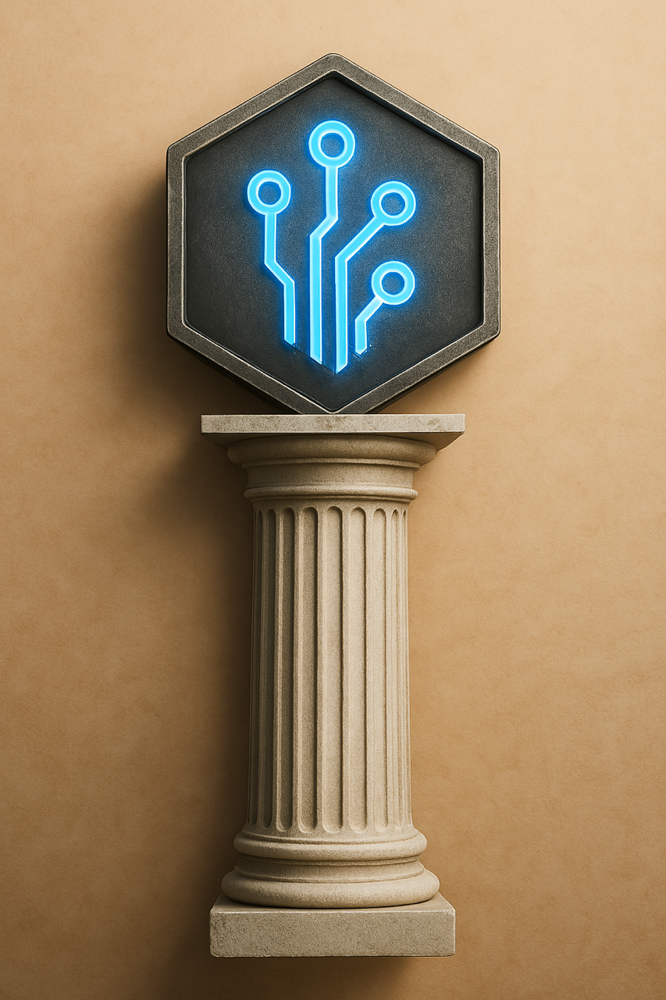

# Tekton Orchestration System

<div align="center">
  
  <h3>Tekton<br>AI Driven Orchestration</h3>
</div>

Tekton is an intelligent orchestration system for AI-driven problem-solving. It coordinates multiple AI models, tools, and resources to efficiently tackle complex software engineering and knowledge work tasks.

## Overview

Tekton serves as the "builder" - the central coordinator between various AI models, tools, and workflows. It intelligently decomposes problems, routes tasks to the appropriate AI models or agents, and manages the execution flow for optimal outcomes.

### Key Features

- **Model Orchestration**: Coordinates between local and remote AI models
- **Task Routing**: Intelligently assigns tasks to the most appropriate models/agents
- **Problem Decomposition**: Breaks complex problems into manageable subtasks
- **Memory Integration**: Leverages Engram for persistent context across sessions
- **Agent Management**: Works with Agenteer for specialized agent creation and workflow
- **Resource Optimization**: Uses the right AI for each task based on complexity and requirements

## Architecture

Tekton uses a layered architecture:

```
┌─────────────────────────────────────────┐
│              Tekton Core                │
│  (Orchestration and Coordination Layer) │
└───────────────┬─────────────────────────┘
                │
    ┌───────────┴───────────┐
    │                       │
┌───▼───────────┐   ┌───────▼─────────┐
│ Model Manager │   │ Workflow Engine │
└───────┬───────┘   └────────┬────────┘
        │                    │
┌───────▼───────┐   ┌────────▼────────┐
│ Local Models  │   │ Remote Services │
└───────────────┘   └─────────────────┘
```

## Integration

Tekton integrates with:

- **Codex**: For AI-assisted software engineering
- **Engram**: For persistent memory across sessions
- **Ergon**: For specialized agent creation and workflow management
- **Rhetor**: For AI communication, prompt engineering and context management
- **Sophia**: For Machine Learning, self improvement of Tekton and all component operations
- **Telos**: For User communication, requierments development & analysis, evaluation and goals
- **Local Models**: Deepseek Coder, CodeLlama, etc.
- **Remote APIs**: Claude, GPT, etc.

## Requirements

- Python 3.10+
- Linux or macOS

## Installation

Tekton uses the modern UV package manager for fast, reliable Python dependency management.

### Quick Install

```bash
# Install Tekton with UV
./tekton-install.sh
```

### Manual Installation

1. Install UV package manager:
   ```bash
   curl -LsSf https://astral.sh/uv/install.sh | sh
   ```

2. Create a Python environment:
   ```bash
   uv venv .venv --python=python3.10
   source .venv/bin/activate
   ```

3. Install Tekton Core:
   ```bash
   uv pip install -e tekton-core
   ```

### Setting Up Components

First, initialize all submodules:

```bash
# Clone submodules (required after initial clone)
git submodule update --init --recursive
```

Then set up individual or all Tekton components:

```bash
# Setup a specific component
./component-setup.sh Engram

# Setup all components
./setup-all.sh
```

## External Tool Registration

Tekton supports external tool registration through Ergon's MCP (Model Control Protocol) integration. This allows tools to be dynamically registered, discovered, and used by various components.

### Registering a Tool

```python
from ergon.core.repository.mcp import register_tool

# Register a Python function as an MCP tool
def my_tool(input_text: str, max_length: int = 100) -> str:
    """Process the input text and return a result."""
    # Implementation
    return result

register_tool(
    name="text_processor",
    description="Processes text input",
    function=my_tool,
    schema={
        "name": "text_processor",
        "parameters": {
            "type": "object",
            "properties": {
                "input_text": {
                    "type": "string",
                    "description": "Text to process"
                },
                "max_length": {
                    "type": "integer",
                    "description": "Maximum length",
                    "default": 100
                }
            },
            "required": ["input_text"]
        }
    },
    tags=["text", "processing"]
)
```

### Using the Decorator

```python
from ergon.core.repository.mcp import mcp_tool

@mcp_tool(
    name="image_analyzer",
    description="Analyzes images",
    schema={
        "name": "image_analyzer",
        "parameters": {
            "type": "object",
            "properties": {
                "image_url": {
                    "type": "string",
                    "description": "URL of the image"
                }
            },
            "required": ["image_url"]
        }
    },
    tags=["image", "analysis"]
)
def analyze_image(image_url: str) -> dict:
    """Analyze an image and return metadata."""
    # Implementation
    return result
```

### Listing Available Tools

```python
from ergon.core.repository.mcp import get_registered_tools, get_tool
from ergon.core.repository.repository import RepositoryService

# Get all registered MCP tools with metadata
all_tools = get_registered_tools()
for name, tool_info in all_tools.items():
    print(f"Tool: {name}")
    print(f"  Description: {tool_info['description']}")
    print(f"  Version: {tool_info['version']}")
    print(f"  Tags: {', '.join(tool_info['tags'])}")
    print(f"  Schema: {tool_info['schema']['parameters']}")

# Get detailed information about a specific tool
text_tool = get_tool("text_processor")
if text_tool:
    print(f"Found tool: {text_tool['name']}")
    print(f"Metadata: {text_tool['metadata']}")

# Search for tools with specific capabilities using the repository
repo = RepositoryService()
image_tools = repo.search_components("image", limit=5)
for tool, score in image_tools:
    print(f"Found image tool: {tool.name} (relevance: {score:.2f})")
    for capability in tool.capabilities:
        print(f"  Capability: {capability.name}")
```

For more detailed examples, see the [MCP Tool Registration documentation](/Ergon/ergon/core/repository/mcp/README.md).

## License

MIT License
