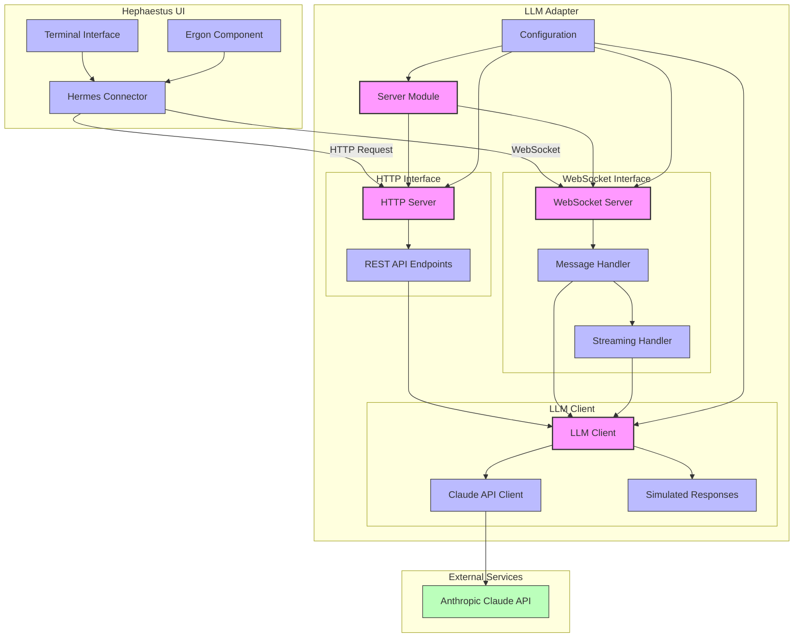
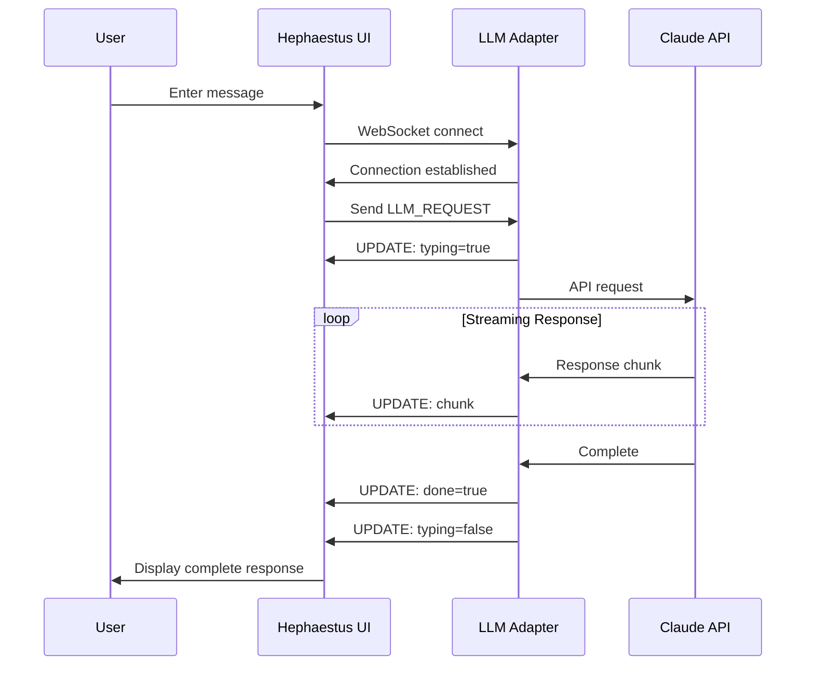
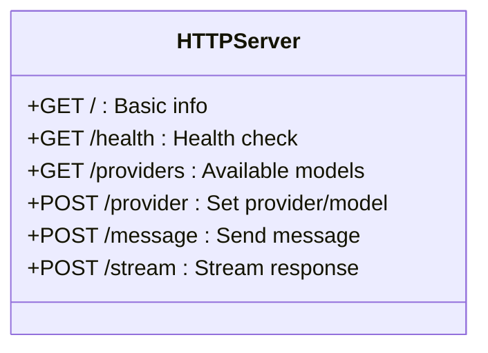
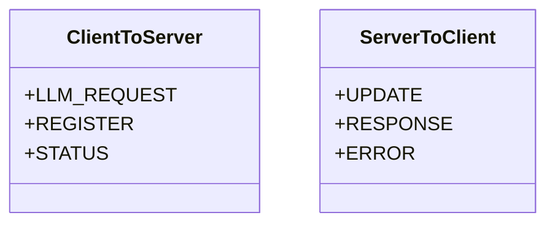
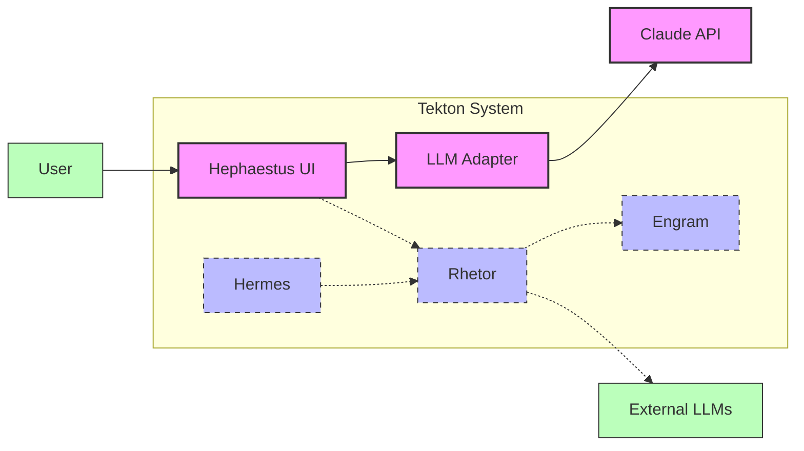
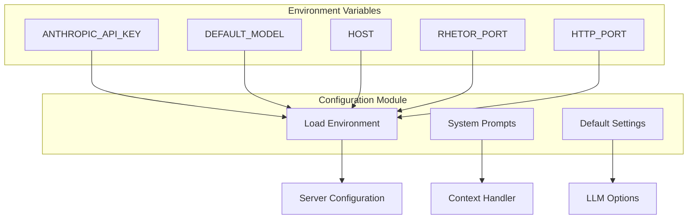

# LLM Adapter Architecture

## Component Flow

### Request Flow

1. **User Interaction**:
   - User enters a message in the Hephaestus UI terminal
   - Ergon component captures the input and triggers the Hermes connector

2. **Hermes Connector**:
   - Establishes WebSocket connection to LLM Adapter
   - Formats the message into a standardized request format
   - Sends request to the adapter's WebSocket interface

3. **WebSocket Server**:
   - Receives the request
   - Validates and processes the message
   - Sends typing indicator to the UI
   - Forwards the request to the LLM Client

4. **LLM Client**:
   - Determines whether to use Claude or simulated responses
   - Adds appropriate system prompt based on context
   - For Claude, formats the request for Anthropic's API
   - Initiates streaming or non-streaming request

5. **Claude Integration**:
   - Makes API call to Anthropic's Claude service
   - Receives streaming or complete response
   - Handles authentication and rate limiting

### Response Flow

1. **LLM Processing**:
   - Claude API generates response
   - Response is streamed back to the LLM Client

2. **Streaming Response Handling**:
   - LLM Client processes each chunk of the response
   - Formats chunks for the WebSocket interface
   - Manages streaming state

3. **WebSocket Response**:
   - WebSocket server streams chunks back to the UI
   - Sends completion signal when finished
   - Handles any errors that occur

4. **UI Display**:
   - Hermes connector processes incoming chunks
   - Updates the terminal display in real-time
   - Provides typing indicators and completion signals

## Data Flow Sequence

## Component Interfaces

### HTTP API Endpoints

### WebSocket Message Types

## Integration with Tekton Architecture

## Configuration and Environment

