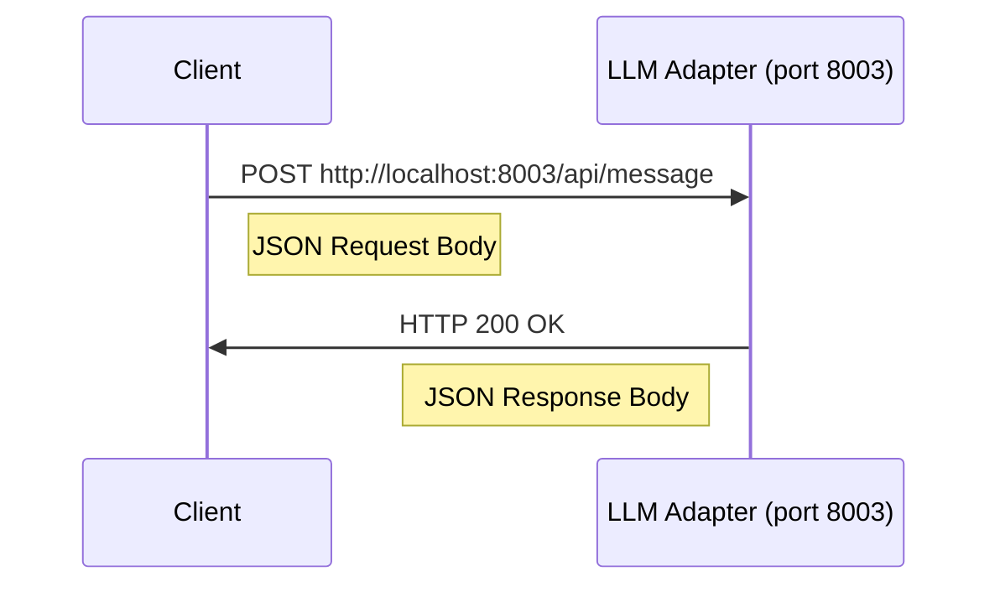
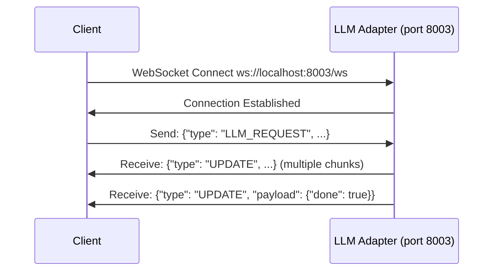

# LLM Adapter: Single Port Architecture Integration

## Overview

The LLM Adapter implements Tekton's Single Port Architecture pattern, which standardizes how components expose their services through a single port with path-based routing. This document outlines how the LLM Adapter integrates with this architecture and provides guidelines for clients connecting to it.

## Single Port Implementation

The LLM Adapter adopts the Single Port Architecture by:

1. Using a single port (default: 8003, the Rhetor port) for all services
2. Implementing path-based routing for different types of requests
3. Maintaining backward compatibility with older interfaces
4. Using environment variables for flexible configuration

## Port Configuration

The LLM Adapter utilizes the following port configuration:

```
RHETOR_PORT = int(os.environ.get("RHETOR_PORT", 8003))
HTTP_PORT = int(os.environ.get("HTTP_PORT", RHETOR_PORT))
WS_PORT = HTTP_PORT  # Use same port for both HTTP and WebSocket
```

This approach:
- Follows the central port assignment scheme (using port 8003 from the [port_assignments.md](../config/port_assignments.md) document)
- Falls back to traditional separate ports when needed for compatibility
- Uses environment variables for consistent configuration

## Endpoint Structure

Under the Single Port Architecture, the LLM Adapter exposes its interfaces through the following endpoint structure:

| Service Type | Path Pattern | Example URL | Description |
|--------------|--------------|-------------|-------------|
| HTTP API | `/api/*` | `http://localhost:8003/api/message` | REST API endpoints for synchronous operations |
| WebSocket | `/ws` | `ws://localhost:8003/ws` | WebSocket endpoint for real-time streaming |
| Status | `/health` | `http://localhost:8003/health` | Health check and status information |

## Client Integration

### Updating Client Code

Clients need to be updated to use the Single Port Architecture when connecting to the LLM Adapter:

#### JavaScript Example:

```javascript
// Old approach (separate ports)
const httpUrl = 'http://localhost:8300';
const wsUrl = 'ws://localhost:8301';

// New approach (Single Port Architecture)
const baseUrl = `http://localhost:${window.RHETOR_PORT || 8003}`;
const httpUrl = `${baseUrl}/api`;
const wsUrl = `${baseUrl.replace('http', 'ws')}/ws`;
```

### Environment Variables in Hephaestus

The Hephaestus UI uses environment variables for connecting to the LLM Adapter:

```javascript
// hephaestus_config.js
const LLM_ADAPTER_CONFIG = {
    // HTTP endpoints - Use environment variable with fallback
    httpUrl: `http://localhost:${window.RHETOR_PORT || 8003}`,
    
    // WebSocket endpoint - Use environment variable with fallback
    wsUrl: `ws://localhost:${window.RHETOR_PORT || 8003}/ws`,
    
    // Other configuration...
};
```

This approach:
- Reads the port from the global environment variable `window.RHETOR_PORT`
- Falls back to the default port (8003) if not specified
- Constructs the correct URLs for both HTTP and WebSocket connections

## Connection Patterns

### HTTP Connection



### WebSocket Connection



## Backward Compatibility

The LLM Adapter maintains backward compatibility with previous implementations:

1. If separate HTTP_PORT and WS_PORT are specified, the adapter will still use them
2. Legacy endpoints without the `/api` prefix are still supported
3. Documentation includes both the new and old connection patterns

## Migration Guide

When migrating existing code to use the Single Port Architecture:

1. Update the base URL to use the RHETOR_PORT environment variable with a fallback to 8003
2. Append `/api` to HTTP endpoints
3. Append `/ws` to WebSocket connections
4. Test connections with both the new and old endpoints during transition

### Example Migration

```javascript
// Before
const httpClient = new HTTPClient('http://localhost:8300');
const wsClient = new WebSocketClient('ws://localhost:8301');

// After
const port = window.RHETOR_PORT || 8003;
const httpClient = new HTTPClient(`http://localhost:${port}/api`);
const wsClient = new WebSocketClient(`ws://localhost:${port}/ws`);
```

## Testing Single Port Configuration

You can verify that the LLM Adapter is correctly implementing the Single Port Architecture:

```bash
# Test HTTP API on the single port
curl http://localhost:8003/health

# Test HTTP API with /api prefix
curl http://localhost:8003/api/health

# Test WebSocket connection
./test_adapter.py --ws-port 8003 --message "Test single port architecture"
```

## Benefits of Single Port Architecture

The Single Port Architecture provides several benefits:

1. **Simplified Configuration**: Only one port needs to be configured and exposed
2. **Consistent Connection Pattern**: All Tekton components follow the same connection pattern
3. **Easier Firewall Configuration**: Only one port needs to be opened
4. **Simpler Reverse Proxy Setup**: All traffic can be routed through a single entry point
5. **Future-Proof**: Compatible with container orchestration systems like Kubernetes

## Challenges and Solutions

| Challenge | Solution |
|-----------|----------|
| Managing different traffic types on same port | Path-based routing separates HTTP, WebSocket, and other traffic |
| Backward compatibility | Supporting both new and legacy endpoints during transition |
| Client-side configuration | Environment variables with sensible defaults |
| Service discovery | Standard port assignments and environment variables |

## Future Enhancements

Future enhancements to the Single Port Architecture implementation in the LLM Adapter will include:

1. Full API standardization following Tekton API guidelines
2. Automatic service discovery
3. Authentication and authorization integration
4. Metrics and monitoring endpoints
5. Load balancing and scaling support

## Integration with Rhetor

When the LLM Adapter is replaced by Rhetor, the Single Port Architecture will be maintained:

1. Rhetor will use the same port (8003)
2. The same endpoint structure will be preserved
3. WebSocket streaming will follow the same protocol
4. New capabilities will be added under additional paths